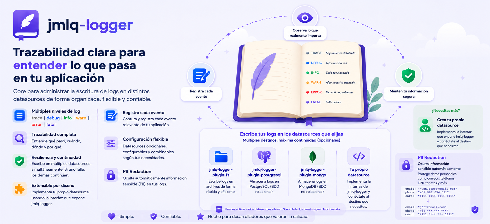

# @jmlq/logger 🧩



## 🎯 Objetivo

Proveer un **logger desacoplado del framework** (Express hoy, otro mañana) que:

- Expone una API simple (`trace|debug|info|warn|error|fatal`).
- Persiste logs a través de uno o varios **datasources** (`ILogDatasource`).
- Permite **redacción de PII** (datos sensibles) antes de persistir.

## ⭐ Importancia

- **Clean Architecture real**: el core no depende de Express, Mongo, Postgres ni filesystem.
- **Fan-out** (multi-datasource) sin que el host tenga que duplicar lógica.
- **PII-by-design**: el mensaje y los metadatos pueden pasar por un redactor antes de salir del proceso.

## 🏗️ Arquitectura (visión rápida)

➡️ Ver detalle en: [architecture.md](./docs/es/architecture.md)

## 🔧 Implementación

### 5.1 Instalación

```bash
npm i @jmlq/logger
```

Para persistencia real, instala un plugin datasource (opcional):

```bash
npm i @jmlq/logger-plugin-fs
# o
npm i @jmlq/logger-plugin-mongo
# o
npm i @jmlq/logger-plugin-postgresql
```

### 5.2 Dependencias

- **Runtime**: el core se mantiene minimalista (no integra I/O directamente).
- **Plugins**: integran con filesystem / MongoDB / PostgreSQL y exponen un `ILogDatasource` compatible.

### 5.3 Quickstart (implementación rápida)

Ejemplo funcional usando el plugin de filesystem (datasource real):

```ts
import { createLogger, LogLevel, type PiiRedactorOptions } from "@jmlq/logger";
import { createFsDatasource } from "@jmlq/logger-plugin-fs";

const pii: PiiRedactorOptions = {
  enabled: true,
  blacklistKeys: ["password", "token"],
  patterns: [
    // email
    {
      pattern: "[A-Z0-9._%+-]+@[A-Z0-9.-]+\\.[A-Z]{2,}",
      flags: "ig",
      replaceWith: "[EMAIL]",
    },
  ],
  deep: true,
};

const fsDatasource = createFsDatasource({
  basePath: "./logs",
  mkdir: true,
  rotation: { by: "day" },
});

const logger = createLogger({
  datasources: fsDatasource,
  minLevel: LogLevel.INFO,
  redactorOptions: pii,
});

await logger.info("server.started", {
  port: 3000,
  adminEmail: "admin@example.com",
});
await logger.warn(() => ({ msg: "suspicious.payload", token: "secret" }));
```

### 5.4 Variables de entorno (.env) 📦

`@jmlq/logger` **no lee variables de entorno internamente**. La configuración se hace con código, pasando `ILoggerFactoryConfig` a `createLogger()`.

Si tu host prefiere configurar por `.env`, un patrón típico es mapear `process.env` → `LoggerFactoryConfig`:

```ts
import { createLogger, LoggerUtils, LogLevel } from "@jmlq/logger";

const minLevel: LogLevel = LoggerUtils.parseLogLevel(
  process.env.LOG_LEVEL,
  LogLevel.INFO,
);

// ...construye uno o más datasources según tu host
```

### 5.5 Helpers y funcionalidades clave

- **Fan-out multi-datasource**
  - Si pasas `datasources: ILogDatasource[]`, el core compone un datasource “composite” (`DataSourceService`) y hace fan-out a todos los destinos.
  - Además, indexa en memoria lo escrito para soportar `getLogs()` incluso si algún datasource no implementa `find()`.

- **PII Redaction (PiiRedactor)**
  - Redacta `message` y `meta`.
  - Soporta `patterns` (RegExp serializable), `whitelistKeys`, `blacklistKeys` y `deep`.

- **Mensaje perezoso (lazy message)**
  - `logger.info(() => ({ ... }))` evalúa el mensaje solo si el nivel pasa el filtro.

## ✅ Checklist (pasos rápidos)

- [Instalar](#51-instalación)
- [Elegir un datasource](./docs/es/configuration.md#datasources-y-plugins)
- [Configurar PII](./docs/es/configuration.md#pii-redaction)
- [Integrar en Express](./docs/es/integration-express.md)
- [Checklist de troubleshooting](./docs/es/troubleshooting.md)

## 🧩 Ejemplo de implementación

- [Consultar documentación e integración real](https://github.com/MLahuasi/jmlq-ecosystem/blob/main/doc/es/%40jmlq/logger/core.md)

## 📌 Menú

- [Arquitectura](./docs/es/architecture.md)
- [Configuración](./docs/es/configuration.md)
- [Integración Express](./docs/es/integration-express.md)
- [Troubleshooting](./docs/es/troubleshooting.md)

## 🔗 Referencias

Plugins de persistencia:

- [`@jmlq/logger-plugin-fs`](https://github.com/MLahuasi/jmlq-logger-plugin-fs/blob/main/README.es.md)
- [`@jmlq/logger-plugin-mongo`](https://github.com/MLahuasi/jmlq-logger-plugin-mongo/blob/main/README.es.md)
- [`@jmlq/logger-plugin-postgresql`](https://github.com/MLahuasi/jmlq-logger-plugin-postgresql/blob/main/README.es.md)

## ⬅️ 🌐 Ecosistema

- [`@jmlq`](https://github.com/MLahuasi/jmlq-ecosystem#readme)
