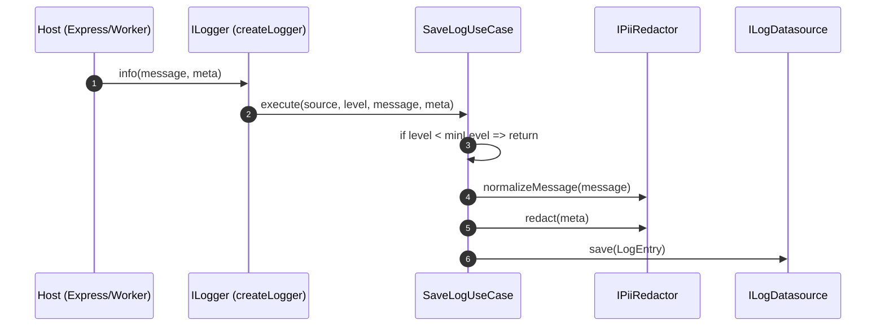
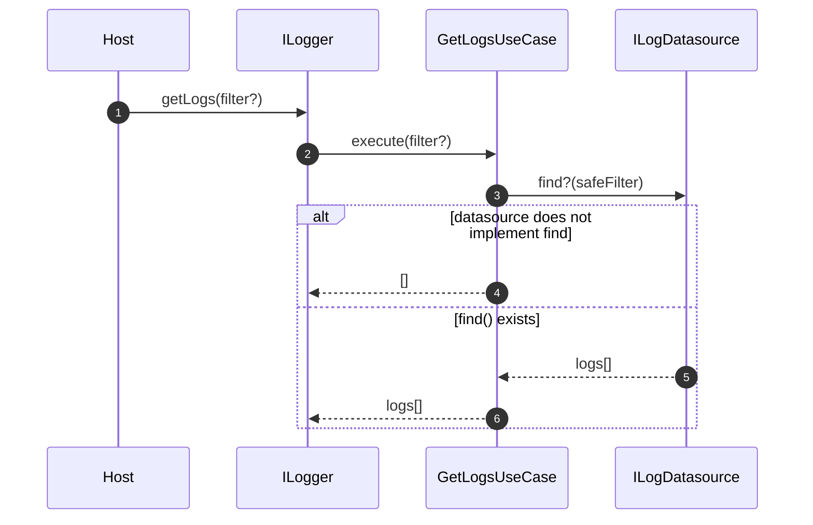
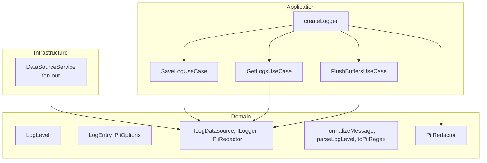

# @jmlq/logger — Architecture 🏛️

## 🎯 Objective

Define a framework-independent logging core that allows:

- Persisting logs through `ILogDatasource`
- Redacting PII before writing
- Scaling to multiple destinations (fan-out) without coupling to the host

## ⭐ Importance

- The host decides **where** logs are stored (FS/Mongo/Postgres/other)
- The core decides **how** logs are normalized, redacted, and filtered by level
- Switching from Express to another runtime does not affect the core, only the integration

## 🧱 Main components (what the package exposes)

### `createLogger(config, source?)`

Main factory. Receives `ILoggerFactoryConfig` and returns an `ILogger`.

- Normalizes `minLevel` (default: `INFO`)
- If multiple datasources are provided, composes `DataSourceService` (fan-out)
- Builds an internal `PiiRedactor` if none is provided
- Connects use cases (`SaveLogUseCase`, `GetLogsUseCase`, `FlushBuffersUseCase`)

### `ILogger`

High-level contract:

- `trace|debug|info|warn|error|fatal`
- `getLogs(filter?)`
- `flush()`

### `ILogDatasource`

Persistence port:

- `save(log)` (required)
- `find?(filter?)` (optional)
- `flush?()` (optional)
- `dispose?()` (optional)

### PII

- `PiiRedactor` + `PiiRedactorOptions`
- Helpers: `LoggerUtils.parseLogLevel`, `LoggerUtils.normalizeMessage`, `LoggerUtils.toPiiRegex`

## 🔁 Flows (diagrams)

### Write flow (save)

### Read flow (getLogs)

## 🧩 Clean Architecture (real mapping)

## ✅ Checklist

- [ ] Define at least one `ILogDatasource` (plugin or custom implementation)
- [ ] Decide the `minLevel`
- [ ] Configure `PiiRedactorOptions` (or provide a custom `IPiiRedactor`)
- [ ] Integrate `ILogger` into the host (via DI/middleware/adapter)

## ⬅️ Previous

- [`home`](../../README.md)

## ➡️ Next

- [Configuration](./configuration.md)
- [Express Integration](./integration-express.md)
- [Troubleshooting](./troubleshooting.md)
