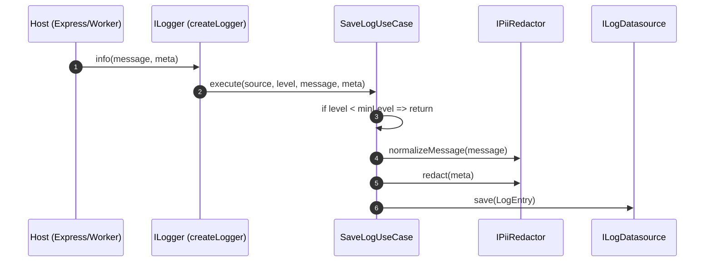
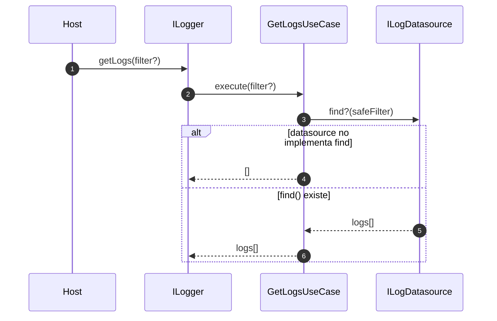
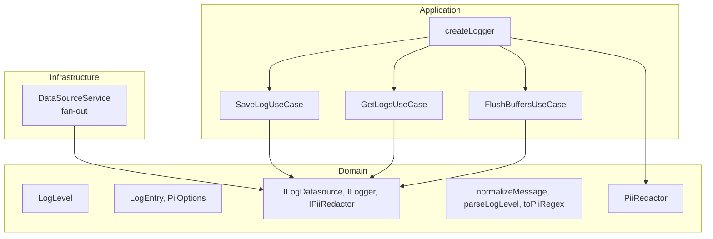

# @jmlq/logger — Architecture 🏛️

## 🎯 Objetivo

Definir un core de logging independiente del framework que permita:

- Persistir logs mediante `ILogDatasource`.
- Redactar PII antes de escribir.
- Escalar a múltiples destinos (fan-out) sin acoplar al host.

## ⭐ Importancia

- El host decide **dónde** se guardan logs (FS/Mongo/Postgres/otro).
- El core decide **cómo** se normaliza, redacta y filtra por nivel.
- Cambiar de Express a otro runtime no cambia el core, solo la integración.

## 🧱 Componentes principales (lo que expone el paquete)

### `createLogger(config, source?)`

Factory principal. Recibe `ILoggerFactoryConfig` y devuelve un `ILogger`.

- Normaliza `minLevel` (default: `INFO`).
- Si hay múltiples datasources, compone `DataSourceService` (fan-out).
- Construye `PiiRedactor` interno si no pasas `redactor`.
- Conecta use-cases (`SaveLogUseCase`, `GetLogsUseCase`, `FlushBuffersUseCase`).

### `ILogger`

Contrato de alto nivel:

- `trace|debug|info|warn|error|fatal`
- `getLogs(filter?)`
- `flush()`

### `ILogDatasource`

Puerto de persistencia:

- `save(log)` (obligatorio)
- `find?(filter?)` (opcional)
- `flush?()` (opcional)
- `dispose?()` (opcional)

### PII

- `PiiRedactor` + `PiiRedactorOptions`
- Helpers: `LoggerUtils.parseLogLevel`, `LoggerUtils.normalizeMessage`, `LoggerUtils.toPiiRegex`.

## 🔁 Flujos (diagramas)

### Flujo de escritura (save)

### Flujo de lectura (getLogs)

## 🧩 Clean Architecture (mapeo real)

## ✅ Checklist

- [ ] Definir al menos un `ILogDatasource` (plugin o implementación propia).
- [ ] Decidir el `minLevel`.
- [ ] Configurar `PiiRedactorOptions` (o proveer un `IPiiRedactor` custom).
- [ ] Integrar `ILogger` en el host (por DI/middleware/adapter).

## ⬅️ Anterior

- [`inicio`](../../README.es.md)

## ➡️ Siguiente

- [Configuración](./configuration.md)
- [Integración Express](./integration-express.md)
- [Troubleshooting](./troubleshooting.md)
